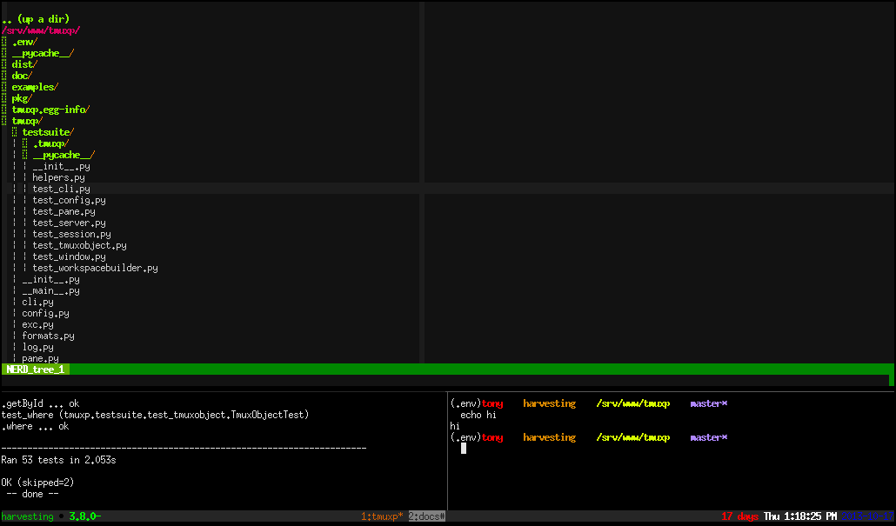

.. module:: tmuxp

.. _developing:

======================
开发和测试
======================

.. todo::
    link to sliderepl or ipython notebook slides

所有的测试文件都放在 ``tests/``。 测试用例用 `pytest`_ 实现的。

``make test`` 将使用``$ tmux -L test_case``命令用``socket_name``启动过一个新的tmux的会话。

.. _pytest: http://pytest.org/

.. _install_dev_env:

从git安装最新版的代码
--------------------------------

在开始开发之前，需要从github上检出代码：

.. code-block:: bash

    $ git clone git@github.com:tony/tmuxp.git
    $ cd tmuxp

接下来创建一个virtualenv。 如果你还不知道这是啥东西的话，就按照下面的命令打就可以了：

.. code-block:: bash

    $ virtualenv .venv

然后，在你当前的终端会话上激活它：

.. code-block:: bash

    $ source .venv/bin/activate

干得漂亮！接下来执行下面这些命令：

.. code-block:: bash

    $ pip install -e .

你的事先安装过pip，这个是python的软件包管理器。
这个命令的意思是在当前目录下安装python的软件包。
``-e`` 这个参数是 ``--editable``，意思是你可以编辑安装的软件包，并且已经安装的软件能反映出这个更改。

.. code-block:: bash

    $ tmuxp

测试执行器
-----------

如上所见，由于你已经在虚拟环境中，你可以使用``tmuxp``命令了。
你的``PATH``环境变量已经更新为对应到你的``.venv``目录下指定的python版本，并且有自己独立的软件包。

.. code-block:: bash

    $ make test

You probably didn't see anything but tests scroll by.

If you found a problem or are trying to write a test, you can file an
`issue on github`_.

.. _test_specific_tests:

测试执行器的参数
~~~~~~~~~~~~~~~~~~~

只测试一个文件:

.. code-block:: bash

    $ py.test tests/test_config.py

将只执行 ``tests/test_config.py`` .

.. code-block:: bash

    $ py.test tests/test_config.py::test_export_json

将测试``test_config.py``里的``test_export_json``方法。

用空格来隔开多个文件：

.. code-block:: bash

    $ py.test tests/test_{window,pane}.py tests/test_config.py::test_export_json

.. _test_builder_visually:

可视化测试
~~~~~~~~~~~~~~

你可以通过在一个单独的终端中挂载测试的那个会话来可视化的观察测试用例跑测试的过程。

创建2个终端:

  - 终端 1: ``$ tmux -L test_case``
  - 终端 2: ``$ cd`` 到tmuxp的项目目录，并且进入到你正使用的 ``virtualenv`` 。 
    然后:

    .. code-block:: bash
    
        $ py.test tests/test_workspacebuilder.py

终端 1 应该动起来了，并且在你的眼前开始创建会话。正常情况下，tmupx对用户隐藏了这个细节。

保存时执行测试
-----------------

你可以在编辑文件的时候同时触发测试。

.. note::
    需要安装 ``entr(1)``.

安装 `entr`_.  这个包在绝大部分的Linux系统中都有。包括：Debian, Ubuntu, FreeBSD, OS X。

当编辑任何py文件的时候需要跑测试用例的做法：

.. code-block:: bash

    $ make watch_test

You can also re-run a specific test file or any other `py.test usage
argument`_:

.. code-block:: bash

   $ make watch_test test=tests/test_config.py

   $ make watch_test test='-x tests/test_config.py tests/test_util.py'

保存时重新生成sphinx文档
~~~~~~~~~~~~~~~~~~~~~~~~~~~

当``.rst``文件被编辑后，自动触发构建文档： 

.. code-block:: bash

   $ cd doc
   $ make watch

.. _tmuxp developer config:

tmuxp developer config
----------------------

After you :ref:`install_dev_env`, when inside the tmuxp checkout:

.. code-block:: bash

    $ tmuxp load .

this will load the ``.tmuxp.yaml`` in the root of the project.

.. literalinclude:: ../.tmuxp.yaml
    :language: yaml

.. _travis:

Travis CI
~~~~~~~~~

tmuxp uses `travis-ci`_ for continuous integration / automatic unit
testing.

tmuxp is tested against tmux 1.8 and the latest git source. Interpretters
tested are 2.6, 2.7 and 3.3. The `travis build site`_ uses this
`.travis.yml`_ configuration:

.. literalinclude:: ../.travis.yml
    :language: yaml

.. _py.test usage argument: https://pytest.org/latest/usage.html
.. _entr: http://entrproject.org/
.. _travis-ci: http://www.travis-ci.org
.. _travis build site: http://www.travis-ci.org/tony/tmuxp
.. _.travis.yml: https://github.com/tony/tmuxp/blob/master/.travis.yml
.. _issue on github: https://github.com/tony/tmuxp/issues
